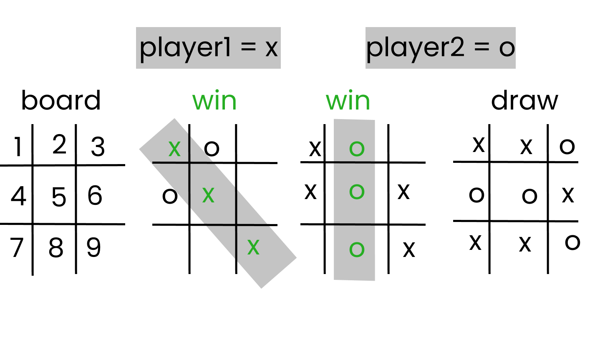

## Tic Tac Toe: Object Oriented Programming(OOP)

> Ruby is an OOP language and nearly everything in Ruby is an object. This project aims to implement the Tic-Tac-Toe game using OOP methods like classes, inheritance, scope, variables, attr_readers & attr_writers as well as the DRY principle and other ruby components like hashes, arrays and data types etc.

## Built With

- Ruby
- Ruby-rubocop
- Github
- Gem

## In this Project there are 3 main files

`````````````````````````````````````````````````````````````````````````````````````````````````````````````
1. main.rb: This file is responsible for getting validated inputs from the user, outputting messages & board.
2. board.rb: This file is responsible for creating the board, possible win-moves and win/draw.
3. Validation.rb: This file is responsible for validation of moves and positions selected by user.
`````````````````````````````````````````````````````````````````````````````````````````````````````````````

## ABOUT THE GAME

> The **TIC-TAC-TOE** game: is a 3 x 3 grid game that takes two player assigned symbol X and O. The players take turns playing by choosing any number between [1 - 9] when a number is picked the spot is marked X or O depending on the player that made the move. **Win** occurs when a player marks 3 grids either vertically, horizontally or diagonally first. Otherwise the game will be a **draw** if no spot are marked either way and all nine spots are marked.



## How to Play
``````````````````````````````````````````````````````````````````````````````````````````````````````````````````````
1. To start the game, input any key
2. Take a look at the Tic-Tac-Toe board with numbers [1 to 9]
3. Input the number from 1 to 9 to get the position where you want to take.
4. Selected position can't be chosen twice
5. Taking turns to play the game with step 3 and 4
6. If either player take 3 grids vertically, horizontally or diagonally first, the player is the **winner**
7. If neither player can take 3 grids until the board is filled with players' symbols, the game is a **draw**
8. If you want to play again, you start again and follow the same steps
```````````````````````````````````````````````````````````````````````````````````````````````````````````````````````
<!-- ## Live Demo -->

<!-- [Live Demo Link](https://livedemo.com) -->

## Getting Started

To get a local copy up and running follow these simple steps to set-up and play the game.
``````````````````````````````````````````````````````````````````````````
- $ git clone https://github.com/jebitok-dev/intermediate-ruby.git
- $ git checkout develop
- $ cd bin/
- $ ruby main.rb (to play the game)
```````````````````````````````````````````````````````````````````````````
## How to Contribute

To get a local copy up and running follow these simple example steps.
```````````````````````````````````````````````````````````````````````````
- Fork the repository
- git clone https://github.com/user-name/intermediate-ruby.git
- git checkout develop
- git checkout -b branch name
- git remote add upstream https://github.com/jebitok-dev/intermediate-ruby/
- git pull upstream develop
- git commit -m "commit message"
- git push -u origin HEAD
```````````````````````````````````````````````````````````````````````````

<!-- ### Prerequisites

### Setup

### Install

### Usage

### Run tests

### Deployment -->

## Author

👤 **Author**

- GitHub: [@Jebitok-dev](https://github.com/jebitok-dev)
- Twitter: [@Jsebitok](https://twitter.com/jsebitok)
- LinkedIn: [LinkedIn](https://linkedin.com/in/sharon-jebitok/)

## 🤝 Contributing

Contributions, issues, and feature requests are welcome!

Feel free to check the [issues page](https://github.com/jebitok-dev/intermediate-ruby/issues).

## Show your support

Give a ⭐️ if you like this project!

<!-- ## Acknowledgments

- Hat tip to anyone whose code was used
- Inspiration
- etc -->

## 📝 License

This project is [MIT](https://mit-license.org/) licensed.
